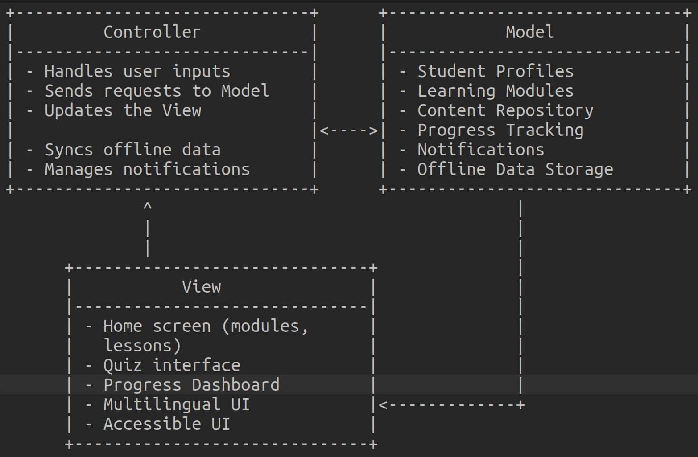
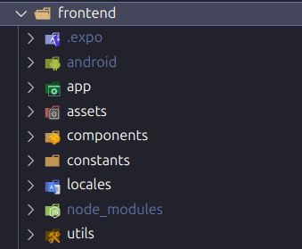
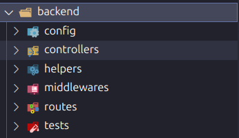

# TEAM GEET


https://github.com/user-attachments/assets/99edf768-0aef-43ad-a765-5e692bf38801


## Our Partner Organization

GEET (**G**irls **E**mpowerment through **E**ducation and **T**ransformation) is a non-profit focused on providing accessible and quality education for rural high school girls in India.

## The Problem

As GEET is rapidly expanding their organization, it became harder to keep track of progress between all their mentors and students and to share educational content with everyone involved. They wanted a platform that would make it easier to manage everything and deliver their services more smoothly.

## Product Description & Application Features

We created a mobile application that admins, mentors, and students can use to track progress, communicate more effectively, and to streamline the delivery of the organization's services.

### For Admins

Admins are able to:

- Search the database for users (with filtering options) and view each users profile information
- Change user profile information (such as name, location, bio)
- Send in-app and push notifications to mentors, students, or both groups

### For Mentors

Mentors are able to:

- Upload pdfs to courses, communicating educational content to students
- View a list of students they mentor and their user profile information
- Upload their certification pdfs to their user profile
- View in-app and push notifications sent by admins

### For Students

Students are able to:

- Create an account to personalize their experience and track their individual progress
- Access and view courses they are studying
- View in-app and push notifications sent by admins

### For All Users

All users are able to:

- Change the language of the app between Hindi and Gurjurti
- Change the display between dark mode and light mode

## Accessing Deployment

If you have an Android phone, you can download the most recent export `.apk` of our app located in the link below.
Simply open the Google drive on your **Android Phone**, download, and follow your operating systems prompts to install.

If the APK doesn't work, you can view the following demo video that walks through the functionalities of our app.

**Demo Video**: https://drive.google.com/drive/folders/1o6_wXR_oO_390QKc3Mb6B6eV64A4bZ5L

### Pulling Images

Two images are available for deployment:

- **Latest Builds**: `ghcr.io/csc301-2024-f/project-11-geet:latest`  
  For the newest features and updates. Recommended for development and testing.

- **Stable Builds**: `ghcr.io/csc301-2024-f/project-11-geet:stable`  
  Recommended for production use. Stable builds are updated only before a deliverable.

### Steps for Project Setup + Future Development

**0. Retrieve and Google Service Account Keys using FCM V1**

If you have existing Google Service Account Keys ignore this step and continue to step 1.  
Otherwise, please follow the given Expo documentation to set up a Google Service Account and retrieve a key file: [FCM Credentials Documentation](https://docs.expo.dev/push-notifications/fcm-credentials/)

**1. Clone the Repository**

Start by cloning the existing project repository or by downloading the code base to a git repository:

```bash
git clone https://github.com/csc301-2024-f/project-11-geet
cd <repository-name>
```

**2. Install Dependencies**

Install the required project dependencies:

```bash
npm install
```

All project dependencies will be listed in package.json and package-lock.json

Retrieve your Google service account keys JSON file that you set up in Step 0 and rename it to `google-services.json`.  
Copy the JSON file to the folder: `frontend/android/app`.

**3. Build the Android App**

Ensure you have the Android SDK set up and build the Android app:

```bash
npx expo run:android
```

**4. Run the Project**

Start the Expo development server to run the app:

```bash
npx expo start
```

**5. Open the app on Expo Go or an Emulator**

The app can be run on Expo Go (From an external mobile device) or an Emulator.

### Steps for Deployment

1. **Use the Provided Configuration**:  
   The `docker-compose.yml` and `sample-env.env` files in the `examples` directory are pre-configured for deployment. Adjust the `.env` file with your credentials as needed.

2. **Login to GitHub Container Registry (GHCR)**:  
   To pull the images, you need to authenticate with Docker using a personal access token, as required by the organization's rules:

   ```bash
   docker login ghcr.io -u YOUR_GITHUB_USERNAME --password-stdin
   ```

   Replace YOUR_GITHUB_USERNAME with your GitHub username and use a token with read:packages permission.

3. **Start Deployment**:

   Use Docker Compose to start the services:

   ```bash
   docker-compose --env-file ./path/to/.env up -d
   ```

### Software Engineering Aspects

#### Ease of Deployment

- **Streamlined Deployment Process:** The project is designed for ease of deployment using CI/CD pipelines and containerized solutions like Docker, ensuring that updates and fixes can be applied with minimal effort.
- **Cloud Deployment:** A Docker image of the application is deployed on the cloud using **DigitalOcean**, ensuring high availability and scalability.
- **APK Deployment:** An **APK (Android Package)** was built and deployed for easy distribution and installation on Android devices.
- **Environment Variable Management:** Sensitive information, such as API keys and configuration variables, is handled securely using `.env` files.

#### Testing Infrastructure

- **Automated Testing:** A robust testing suite using tools like Jest and React Native Testing Library ensures that critical workflows are validated regularly.
- **Unit Testing:** Unit tests have been implemented for both the frontend and backend, covering individual components and functions to ensure reliability and correctness.
- **Integration Testing:** Testing covers the interactions between various modules to ensure workflows are seamless and functional.
- **Error Handling:** Comprehensive error-handling mechanisms ensure the app remains functional even in the face of unexpected input or edge cases.

#### Project File Organization

- **MVC Architecture:** The project follows the **Model-View-Controller (MVC)** architectural pattern, ensuring a clean separation of concerns and enhancing maintainability.

## 1. Model

The **Model** represents the application's data, business logic, and rules. It is responsible for:

- Managing the **data** of the application.
- **Handling business logic**, such as calculations, validations, or processes.
- Communicating with the **database** to retrieve, update, or delete information.

### Key Features:

- Does not directly interact with the user interface.
- Notifies the **View** when the data changes.
- Often uses frameworks like **ORMs** (e.g., Sequelize, Hibernate) for database interaction.

### Example:

In an e-commerce app, the `Product` model might define:

- Fields like `name`, `price`, and `stock`.
- Methods to calculate discounts or check stock availability.
- Logic to fetch product data from the database.

---

## 2. View

The **View** is the user interface of the application. It is responsible for:

- Displaying **data** to the user.
- Providing a way for users to interact with the application (buttons, forms, etc.).
- Rendering content dynamically based on updates from the **Model**.

### Key Features:

- Focused on **presentation** and user experience.
- Updates automatically when the **Model** changes (in most frameworks).
- Receives instructions from the **Controller** about what to display.

### Example:

In the same e-commerce app, the `ProductListView` might:

- Show a grid of product cards with names, prices, and images.
- Update dynamically when new products are added.

---

## 3. Controller

The **Controller** acts as an intermediary between the **Model** and the **View**. It is responsible for:

- Handling **user input** (e.g., form submissions, button clicks).
- Updating the **Model** based on user actions.
- Selecting the appropriate **View** to display based on logic.

### Key Features:

- Processes requests and determines responses.
- Decouples the **View** from the **Model** to keep components independent.
- Often includes routing logic in web applications.

### Example:

In the e-commerce app, the `ProductController` might:

- Handle a request to add a new product to the database.
- Validate input and interact with the `Product` model.
- Redirect the user to the updated product list page.

---

## MVC Workflow Example

1. **User Action**: A user clicks "Add to Cart."
2. **Controller**: The `CartController` handles the request, validates the action, and updates the `Cart` model.
3. **Model**: The `Cart` model updates the cart data in the database and notifies the `CartView`.
4. **View**: The `CartView` refreshes to display the updated list of items in the cart.

---

## Benefits of MVC

- **Separation of Concerns**: Each component has a specific responsibility.
- **Scalability**: Easy to add or modify components without affecting the entire application.
- **Maintainability**: Clear boundaries make debugging and updates simpler.

  

- **Modular Codebase:** The project is organized into clearly defined directories for components, assets, services, routes, utilities, and more.
  <br><br>
  
  
- **Scalability:** The modular design makes the codebase easy to extend, allowing for future development without disrupting

#### Aesthetic Elements of the UI

- **Polished User Interface:** The frontend prioritizes aesthetic appeal, with a consistent design language, intuitive navigation, and responsive layouts for various devices.
- **Dark Mode/Light Mode:** Allows users to customize their visual experience, ensuring accessibility in different environments.
- **Typography and Spacing:** Attention to detail in typography, spacing, and color schemes enhances readability and usability.
- **Tailwind CSS for Styling:** The application uses **Tailwind CSS** to achieve consistent, scalable, and maintainable styles while adhering to modern design principles.

#### Type Safety and Industry Standards

- **TypeScript Integration:** The project uses **TypeScript** to ensure type-safe code, minimizing runtime errors and improving developer productivity. This aligns with industry standards for maintainable and scalable codebases.

#### Accommodating Edge Cases

- **Error Handling:** Notifications are displayed to users in case of failed API calls, invalid inputs, or other errors.
- **Empty States:** Designed empty state screens for scenarios where users have no data (e.g., no notifications or courses).
- **Network Issues:** Offline handling ensures users are informed when the app cannot connect to the server.
- **Validation:** Input validation ensures data integrity across all user workflows, reducing potential errors using TypeScript.

### Public Instance

**Base URL**: `http://159.203.19.68:5000/`
If you prefer not to deploy locally, you can use the publicly available instance.

#### Steps:

1.  Use tools like [Postman](https://www.postman.com/) or `curl` to interact with the API.
2.  Example request:

```bash
curl -X POST http://159.203.19.68:5000/api/auth/login
```

3. Expected response: A `200 OK` status with a response confirming the service is running.
4. Use the [postman collection](GEET-Tech%20Backend%20APIs.postman_collection.json) given to import and test a myriad of apis

## Maintaining the Project

### Technical Requirements

To set up and run this application locally, you'll need the following tools and technologies installed on your machine or server:

**Frontend:**

- React Native
- TailwindCSS
- npm

**Backend:**

- Node.js
- Express.js
- MongoDB
- MySQL

**Database:**

- Supabase

### Documentation

We have created documentations for both the frontend and backend, detailing files, features implemented, and testing created and performed.

**Frontend documentation**: [https://github.com/csc301-2024-f/project-11-geet/tree/main/documentation/frontend_documentation.pdf](https://github.com/aungzm/geet-forked/blob/main/frontend_documentation.pdf)

**Backend documentation**: [https://github.com/csc301-2024-f/project-11-geet/tree/main/documentation/backend_documentation.pdf](https://github.com/aungzm/geet-forked/blob/main/backend_documentation.pdf)

## Licenses

The **Apache License 2.0** is applied to the codebase. This license was chosen because it offers permissive usage, allowing others to freely use, modify, and distribute the code while also providing protection through explicit patent rights. This ensures that both contributors and users are safeguarded from patent-related legal risks, making it an appropriate choice for both open-source and commercial projects.

Applying the **Apache License 2.0** has several effects:

- It encourages broader adoption and contribution to the codebase since it allows free use in both proprietary and open-source projects.
- Developers and users are granted significant freedom to modify and redistribute the code, provided they give appropriate credit to the original authors.
- The license's explicit grant of patent rights protects users from potential patent claims, making it more appealing for commercial use compared to other licenses without such protections.

Overall, this license promotes collaboration and innovation while providing legal safeguards for contributors and users.
